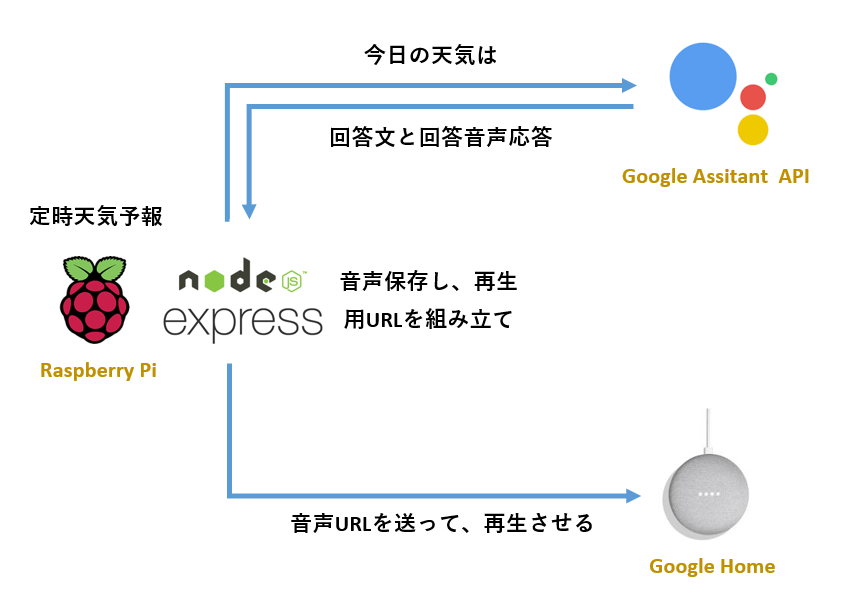

# Google-Home-Weather
Google Assistant APIに問合せし、結果音声をGoogle Homeで再生させる

## Concept


## Requirement
* Google Cloud Platform Project
  * Enable Google Assistant API
  * Enable OAuth2
* NodeJs Express
* google-assistant
* google-home-pusher

## Usage
* Express Server
```js
const express = require('express');
const app = express();

app.use('/weather', express.static('mp3'));

app.listen(9902, () => {
  // URL: http://xxx.xxx.xxx.xxx:9902/weather/xxxx
  console.log('server started on port 9902');

  // start program
  weather();
});
```

* Google Assistant API
```js
const assistant = require('./assistant');

const conversation = {
  lang: 'ja-JP', // 問い合わせ言語
  audio: {
    encodingOut: 'MP3', // 保存用ファイルタイプ
    sampleRateOut: 24000,
  },
};

const query = '今日の天気';

// 問い合わせ音声をmp3フォルダに保存し、ファイル名はCallbackで受け取る
assistant.query({ ...conversation, textQuery: query }).then((fileName: string) => {
  // URLを組み立てし、再生させる
  Home.play(`http://xxx.xxx.xxx.xxx:9902/weather/${fileName}`);

}).catch(console.error);
```

* Google Home
```js
import * as Home from 'google-home-pusher';

// 初期化
Home.ip('xxx.xxx.xxx.xxx');

// 音声再生
Home.play('http://xxx.xxx.xxx.xxx:9902/weather/xxx.mp3');

// 文字から音声に変換し、再生
Home.nofity('こんにちは');

```